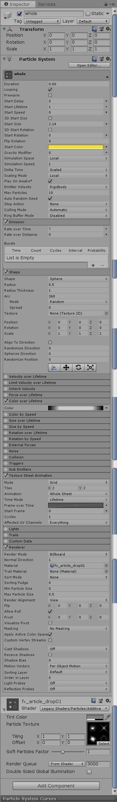
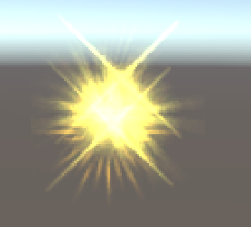
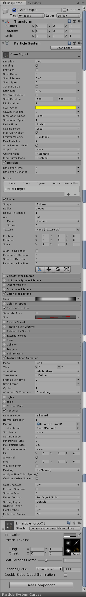
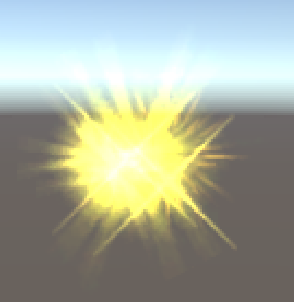
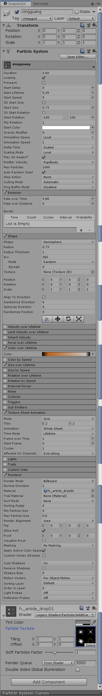
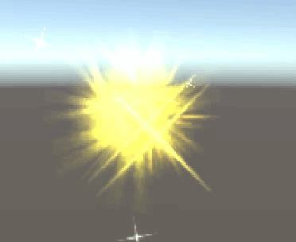
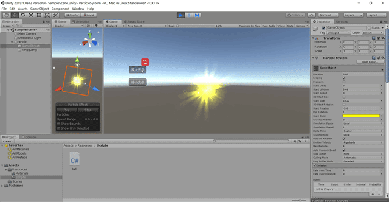

# 简单粒子制作


## 按参考资源要求，制作一个粒子系统

通过参考资料，首先，我们先分解下整体粒子，其中包含哪几个部分：

1.光晕（不止一个）

2.星光

因为光晕是粒子的整体部分，所以我们把它当做粒子的父类节点。
 首先创建一个空对象，并增加组件Particle System，调整相应的参数使之作为魔法球的发光主体。参照博客，把粒子的Speed设置为0，然后粒子的Shape我们可以设置为Sphere，因为我们主要的目的是让光晕填充完这个粒子，显的饱满。



得到了如下的效果：



由于我们现在创建的只是光，并没有很强的光晕，所以修饰的东西就是增强光晕效果。
下面需要给魔法球添加光晕效果。在空物体上添加子部件Particle System，用来制作光晕效果。只要我们把半径啥的都改成0，那么他将从一个点发散出去。



得到的效果如下图所示：



再创建下一个子Particle，取名为XingGuang:

想下星光的特征，也是无中生有，还有就是出生的时候颜色应该和闪光球的颜色一致，然后越来越淡（白色），最后消失于黑暗中（黑色）。



发射的星星的效果如下图：


最后魔法球的效果如下图所示：




## 使用 3.3 节介绍，用代码控制使之在不同场景下效果不一样

用代码实现控制光晕的大小：

```c#
using System.Collections;
using System.Collections.Generic;
using UnityEngine;

public class ball : MonoBehaviour
{
    ParticleSystem particleSystem;
    float time;
    ParticleSystem exhaust;

    void Start()
    {
        time = 0;
        particleSystem = GetComponent<ParticleSystem>();
    }

    [System.Obsolete]
    void Update()
    {
    }

    [System.Obsolete]
    void OnGUI()
    {
        if (GUI.Button(new Rect(100, 150, 70, 30), "放大光晕"))
        {
            particleSystem.startSize = particleSystem.startSize + 0.5f;
        }

        if (GUI.Button(new Rect(100, 200, 70, 30), "缩小光晕"))
        {
            particleSystem.startSize = particleSystem.startSize - 0.5f;
        }

    }

}

```

